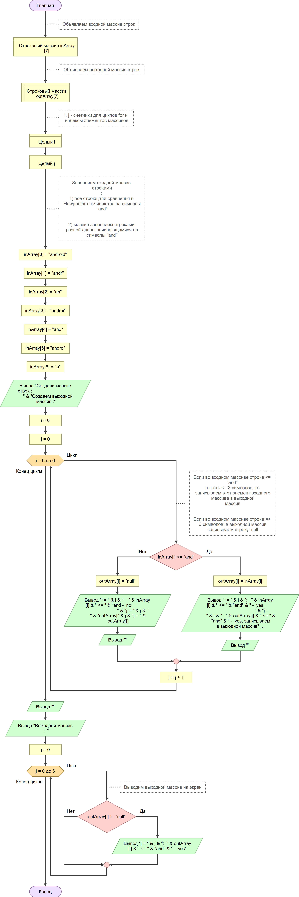

# FinalProject 

## *Итоговая проверочная работа*

1. Создать репозиторий на GitHub
   
2. Нарисовать блок-схему алгоритма
   
3. Добавить файл README.md с описанием решения задачи
   
4. Написать программу, решающую поставленную задачу
   
5. Использовать GitHub в работе над этим проектом.
   В ходе написания кода создать несколько коммитов 
   
## *Задача*

    Написать программу, которая из имеющегося
    массива строк формирует массив из строк,
    длина которых меньше или равна 3-м символам.
    Первоначальный массив можно ввести с клавиатуры,
    либо задать на старте выполнения алгоритма.
    При решении не рекомендуется пользоваться
    коллекциями, лучше обойтись исключительно массивами.

## *Решение задачи*

    1. Вводим длину массива входных данных с клавиатуры.
    Создадим массив входных данных - строк. 
    Заполним в цикле массив строками вводимыми с клавиатуры.
    Выводим получившийся массив в консоль.

    2. Создадим массив выходных данных.
    В цикле проверяем каждый элемент входного массива - строку.
    Если число символов строки <= 3 символа.
    Записываем этот элемент в массив выходных данных.

    3. Выводим результат - массив выходных данных в консоль. 

## *Блок-схема алгоритма программы*

## *Программа на С#*

[Программа на С#](https://github.com/DimaTibilov/FinalProject/blob/main/Select_string.cs)